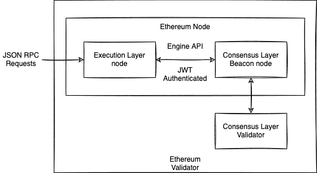
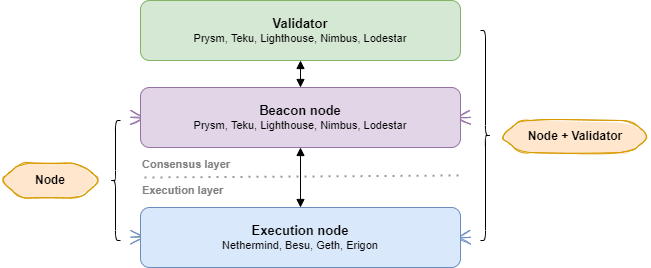

## Ethereum Node Setup Documentation

This documentation focuses on the setup of Ethereum Full Node and Local Private Networks setup.

In future, expanded to used for validators setup or any different combination of the client setups with different hardware.

There is also submodule linking for the referenced git repository for consistency.

An Ethereum full node consists of 2 layer of nodes as shown in the image below:

1. Execution Layer Client (Execution Node)
2. Consensus Layer Client (Beacon Node)

A Ethereum Staking node is the full node plus a Consensus Layer Validator client.

